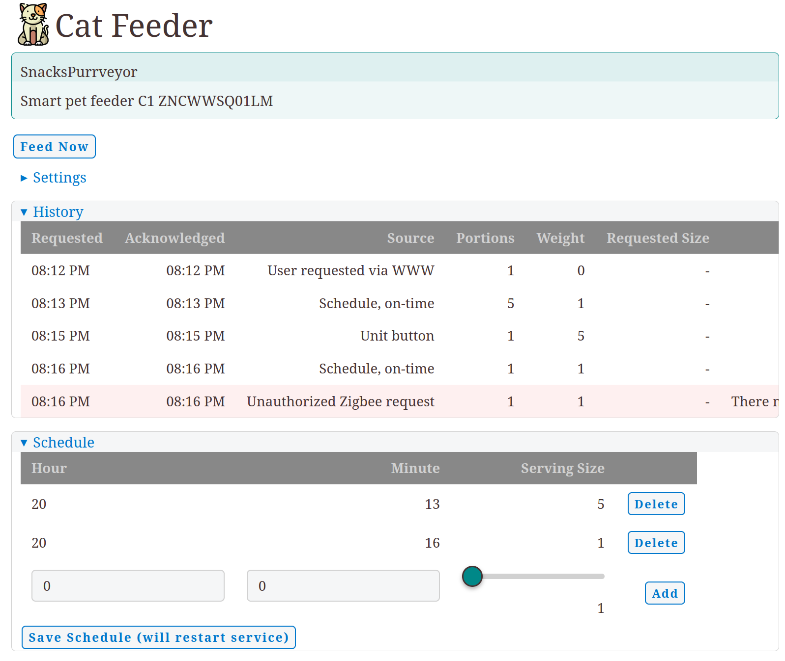
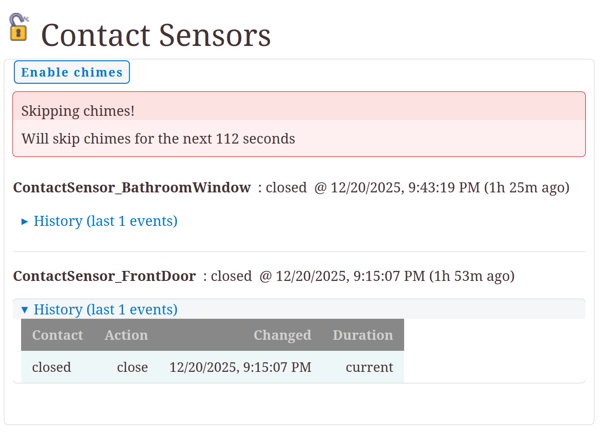
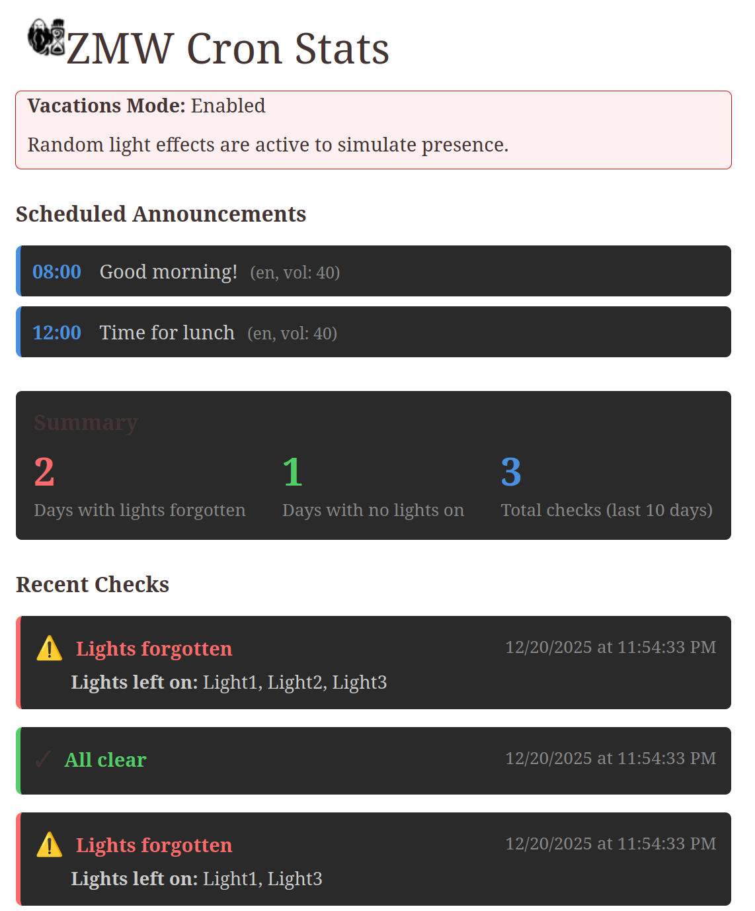
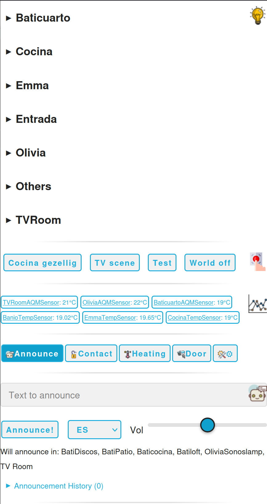
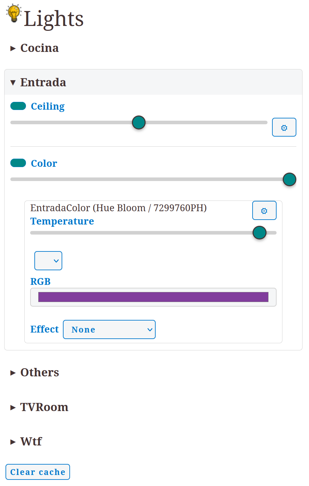
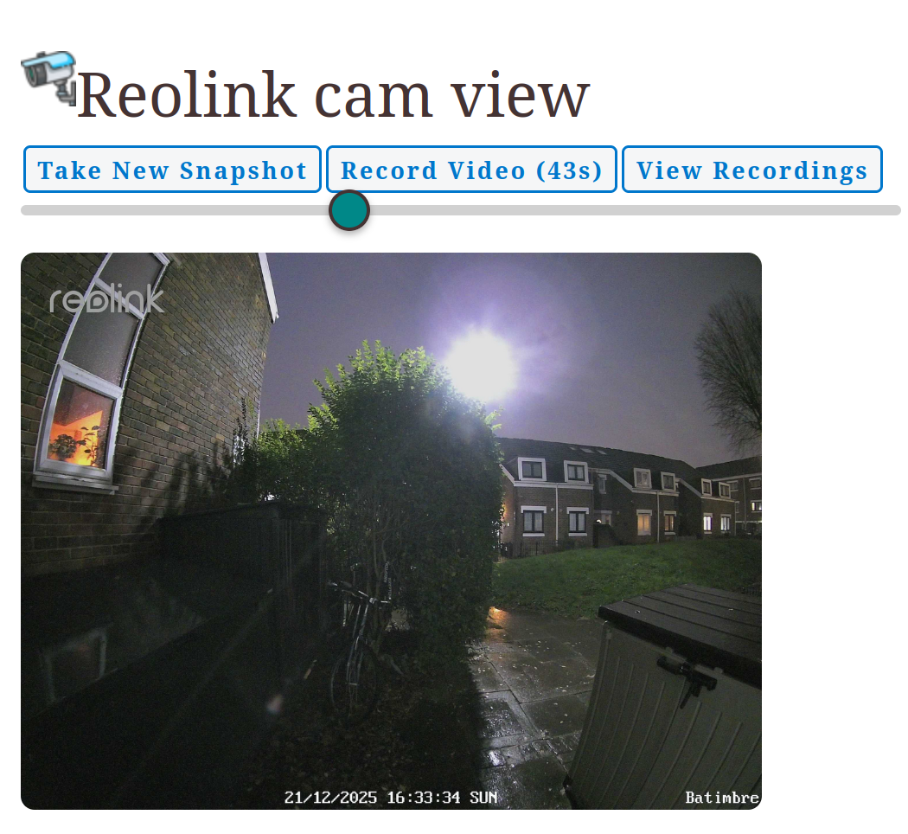
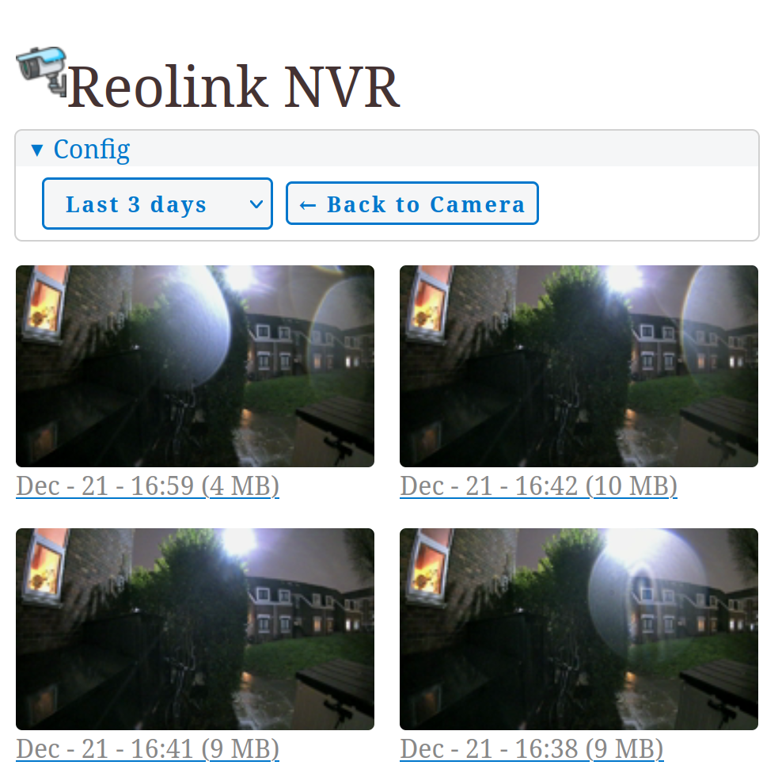
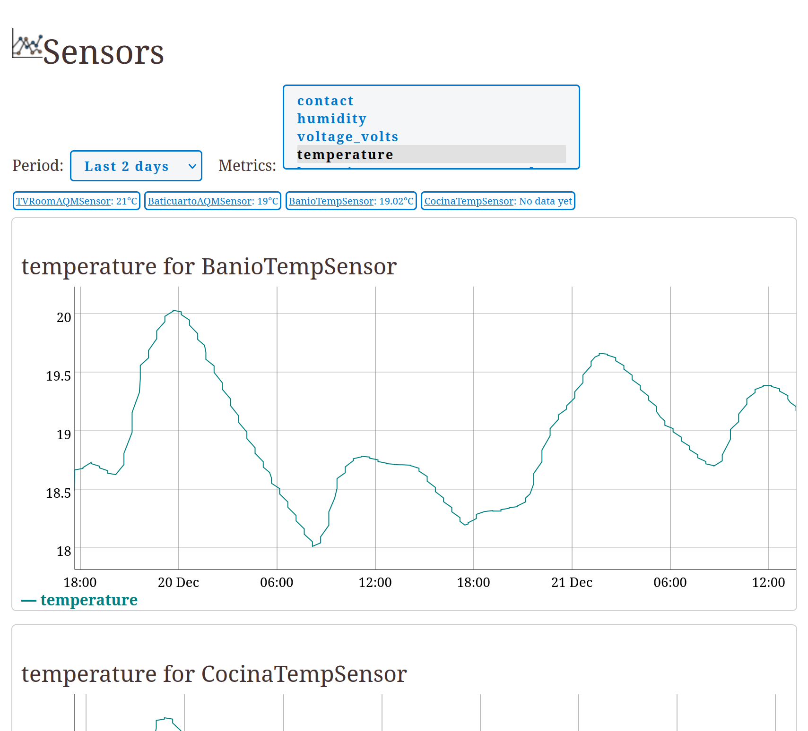
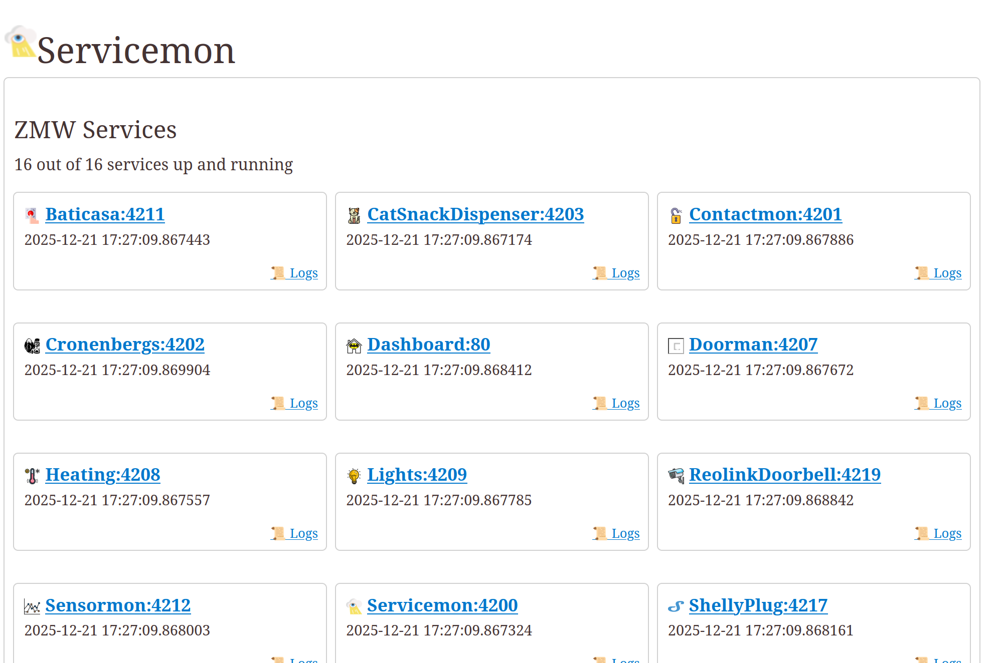
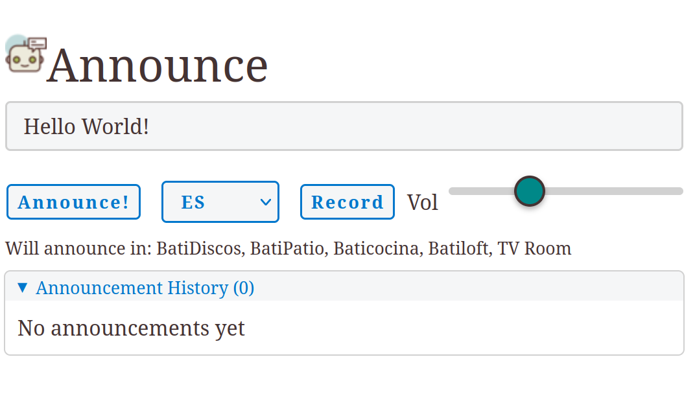

# ZMW

ZMW will expose a Zigbee network as a small set of RESTish endpoints, and provide a basic UI to manage your Zigbee network with a web interface, with sensible defaults and minimal configuration. Clone, do `install_all_svcs.sh` and configure your network. Some things may work.

## What does it do?

The aim of the project is to read mqtt messages broadcasted by Zigbee2mqtt and translate them to objects with an API accessible through REST(ish) URLs, with a very limited set of dependencies, and very little configuration required. The goal is to enable developers to easily configure and extend a zigbee network using Python. The project core is small and extensible so that new thing types may be supported; even non-MQTT based things, like media players with 3rd party API integrations. The project includes extensions for Sonos, Spotify and possibly other non-MQTT things I find useful.

The server is designed to be low footprint, so that it may run in a RaspberryPi. Some time ago even an RPI W Zero might have worked, but now this project runs multiple services and a Zero is unlikely to be a good target anymore.

## Why?
A long time ago - almost 10 years ago? - after trying out Hassio, Home-Assistant and OpenHAB I figured I didn't like them. I'm not too keen on installing an entire OS and fiddling with yaml files for days just to make a button play a video. What to do with all my Zigbee hardware and home automation ideas, then? Easy: spend a week hacking my own. This is the result; not nearly as pretty as Hassio but easier to setup (or that was the case in 2017ish). And now I can add my own buttons using plain Python and HTML.

Who should use this? If you:

* Have a few Zigbee devices but don't want to use a proprietary solution
* Prefer programming Python to debugging yaml files and reading manuals
* Don't mind some hacking

You may find this project useful.

## New setup

* Clone the repo
* make systemdeps
* Install mosquitto and zigbee2mqtt (check out scripts/install_*.sh)
* make install_all_services
* Good luck.

## Architecture and Creating a new service

ZMW is pretty simple:

* zzmw_lib/www has all of the web helpers, including css and base app js helpers. An app needs to be started by its html.
* zzmw_lib/zzmw_lib/*mqtt* has different ZMW service base classes. Pick one for your new service.
* zzmw_lib/zzmw_lib/service_runner is what launches the service. It will start a flask server and your app in parallel, and handle things like journal logs and basic www styles
* zz2m is the proxy to zigbee2mqtt

Start a new service by copying an existing one. Then:

* The main app entry point should be the same name as your service directory. For example, if the service directory is called "zmw_foo", the main entry point for systemd will be "zmw_foo/zmw_foo.py". If your names don't match, the app will work but install and monitoring scripts will break.
* Build your impl in your py file, update the www entry point in www/index.html and www/app.js
* Update any deps in your rebuild_deps makefile target
* Build with `make rebuild_deps`, then `make rebuild_ui`
* Try it out with `make devrun`
* When ready, `make install_svc`. The service will now forever run in the background and you can monitor it from servicemon.

If you are developing a service that won't be upstreamed to zmw:

* common.mk won't work for you, as it will assume you are working on the root of the project. You will need to manager your own pipfile (or copypaste the zmw common makefile).

## Managing services

Install new services with `make rebuild_ui && make install_svc`. This will trigger the install_svc.sh helper script. Once installed, you can:

* Use config_apply and config_merge to manage all service config files from a single place.
* Use restart_and_log to restart a service and tail its logs.
* Use logs.sh to tail the logs of all services in the system.
* There is a restart_all helper that will shutdown and bringup services in an ordered way. This is unnecessary, but it prevents log spam and warnings in the logs while services boot up.
* If you need to refresh the code of a service, just restart it. Service CWD is the ~/run directory specified at install time, but code points to the git repo, making bugfixes easy to deploy.
* If you need to reinstall a service (eg because its dependencies changed, or because a systemd template or script was updated) type `make install_svc` again. The command is idempotent. It will shutdown and clean up the old service, then install the update.

All service management scripts are wrappers on top of systemd/systemctl/journalctl.

# Supported Services

# Cat Snack Dispenser

Ensures cats don't go hungry. Integrates with Aqara ZNCWWSQ01LM aqara.feeder.acn001.

Cat feeder service will

* Integrate with Telegram, and create a bot command; sending /DispenseCatSnacks will feed your cats
* Send a Telegram notification when food is being dispensed: get a notice when the feeding schedule triggers
* Send a Telegram notification when food is being dispensed when food is dispensed out of schedule: get an alarm if your cats have discovered how to press a button in the unit to get food
* Receive alarms if the unit reports errors, or if the feeding schedule isn't triggering the dispensing of snacks

This service will read a schedule from its config file, and then upload the schedule to the unit, so that this service dies snack dispensing isn't affected. It will also monitor that the unit is respecting the schedule, to ensure that, as a fallback, it can trigger automatic dispensing. If the unit doesn't report any feeding, it will notify you, so that you can manually feed your pets.

# ZmwContactMon

Contact sensor monitoring with timeout and curfew alerts.
Monitors Zigbee contact sensors (doors, windows). On state change, triggers configured actions (notifications over SMS, announcements on local speaker).

This service will monitor transitions in contact sensors between open (non-normal) and closed (normal). With this service, you can

* Monitor state of contact sensors in a Zigbee network.
* Trigger actions when a sensor changes from open to close, or from close to open.
* Trigger actions when a sensor has been left open for too long (eg if someone forgot a door open).
* Trigger actions when a sensor is open after a curfew time (eg if someone forgets a window open at night).
* Skip alerts: if you have a door-open alert, and you come home late, there's a button to disable chimes that may wake people up.

## Actions

The following actions are supported for each transition (normal/closed, non-normal/open, timeout, curfew):

* Telegram: delivers a message to a Telegram service (which will relay it to a set of contacts).
* Whatsapp: delivers a picture to a Whatsapp service, similar to Telegram.
* tts_announce: will ask a LAN speaker announcement service to broadcast a message over loudspeakers. Google translate will be used as a TTS service. Different languages supported.
* sound asset annoucne: ask a LAN speaker announcement service to broadcast a chime/sound effect, using a local file or a URL accessible to the speakers.

## WWW Endpoints

- `/svc_state` - Current sensor states, history, chime status
- `/skip_chimes` - Temporarily disable chime notifications
- `/skip_chimes_with_timeout/<secs>` - Disable chimes with timeout
- `/enable_chimes` - Re-enable chime notifications

# ZMWCronenbergs

Runs calendar-based automation tasks:

* Checks for lights left on in the morning, turns them off, and sends a Telegram notification if any were one. Use if you want to automatically turn off lights during the week day after people have left the house.
* Vacations mode: will randomly turn lights on and off in the late afternoon, the evining and then at night will shut every light off - to simulate as if people were wondering around the house.
* Speaker-announce: at scheduled times, will play an announcement through the speakers, every day. Useful to remind house-inhabitants of periodic tasks.
* Battery alerts: every week, it will check which devices have low battery, and send a Telegram reminder.

# ZmwDashboard

Dashboard system that ties all other ZMW services to a mobile friendly interface.

This service integrates with all other ZMW services running in the system to

* Enable quick lights control.
* Exposes scenes ("fake" buttons created by a user-service, which perform a set of actions on other ZmwServices). These are grouped together with lights, so that each group of lights has a set of scenes/action-buttons assigned to it.
* Exposes a list of sensors, by default showing temperature.
* Speaker-announce: send an announcement through the Sonos LAN speakers in your network (user recording not supported here: running the dashboard via HTTPS with a self-signed cert is painful!)
* Each section (lights, scenes, sensors, cameras...) can link to the main service, which exposes further functionality.
* Contact monitoring: expose door states, and lets you bypass chimes (if your door is configured to play a chime when open).
* Heating: monitor heating state and turn it on/off
* Doorbell cam: show last snap of the doorbell camera, and lets you take a new one. Also displays if the doorbell has rung recently.
* Theming: supports Classless CSS themes.
* Links to user-defined services: add more links to all of those services running in your LAN, so you have a centralised place to access them.
* System alerts: display any system level alerts, such as services down or your cat running out of food.

# baticasa_doorbell

Doorbell event handler and notification coordinator.

Orchestrates door events:
* plays announcement sounds on doorbell button press
* sends photos via WhatsApp/Telegram when cam detects motion
* responds to Telegram commands (`/door_snap`) if user requests door picture
* Manages door-open scene based on contact sensor and geolocation (automatically turn on lights if it's dark out when the door opens)

# ZmwHeating

Heating system manager controlling a boiler via Zigbee relay.

This service controls an on/off relay powering a boiler, based on a configurable schedule. It doesn't support any kind of OpenTherm or other advanced boilers, just on/off. This service

* Allows to set a schedule by 15-minute increments: the schedule can be always-on, always-off or rule based. Always on/off will always turn the boiler on/off at the specified time. Rule-based means the service decides the state of the system based on a set of rules.
* Enables quick user overrides: the UI has a "boost" button that will turn on the heating for an hour or two, overriding current rules.
* Quick off override: when the boiler is on but is not needed, override-off will turn the boiler off until the next time a new rule would apply (either a new schedule, a new user override, or a change in rule type).
* Telegram overrides: the service integrates with the ZmwTelegram service, if the service is running. You can send `/tengofrio` via Telegram to have a warm toasty home when you arrive home.
* Telegram notifications: no need to wait 10 minutes to know if the radiators will get warm, ZmwHeating will send you a Telegram message when the boiler turns on (or off). No need to guess on what the boiler state is.
* Rule based heating: this service will read Zigbee2Mqtt sensors. You can build rules based on these:
    * AlwaysOn/AlwaysOff is a rule that will always turn the boiler on/off. This is a fallback default rule.
    * CheckTempsWithinRange will turn a boiler on if a temperature is outside of a target range, with some hysteresis.
    * ScheduledMinTargetTemp works like CheckTempsWithinRange but during a specified time window.
* Schedule saving: the service will remember today's schedule, and a template configuration. Boiler state will survive any service crash.

## Explainability First

The service is built with explainability-first goals: it should always be clear why the system is in the state it is. The service will "explain" which rules apply to turn the boiler on or off, via Telegram and via its web UI. Over Telegram, for example, it will deliver a message such as `Heating is now on (was off). Reason: Sensor TempSensor reports 18.94C, target is 20.0C between 08:00:00 and 09:00:00`.

## WWW Endpoints

- `/svc_state` - Current schedule, boiler state, sensor readings
- `/get_cfg_rules` - Configured heating rules
- `/active_schedule` - Current day's schedule
- `/boost=<hours>` - Activate heating boost
- `/off_now` - Turn heating off immediately
- `/slot_toggle=<name>` - Toggle a schedule slot
- `/template_slot_set=<vals>` - Set template slot
- `/template_apply` - Apply template to today
- `/template_reset=<state>` - Reset template schedule
- `/template_schedule` - Get template schedule

# ZmwLighs

Zigbee light discovery and control service.

Connects to Zigbee2MQTT, discovers all light devices on the network, and exposes them via a web API. Applies light helper patches for extended functionality. The app favours convention over configuration, and will

* Automatically group set of lights; if a set of lights starts with a prefix, they will be presented as a group. A set of lights like "TVRoomLight1", "TVRoomLight2", "TVRoomLight2", for example, will be shown as "Light1", "Light2", "Light3", under group "TVRoom".
* Show a compact, mobile friendly, view of all the lights discovered, and quickly adjust brightness and on/off status.
* An extended configuration panel is shown for lights that support extra settings. Currently supported: RGB, colour temperature, light effects.
* Backend service contains random patches to work around/normalize behaviour of a few different lights, eg adding support for RGB methods where only CIE XY is supported. Don't try to pick black colour for your lights.
* Backend provides a hash for the known lights. This lets the frontend query copious amount of metadata per light, and cache it, without risk of showing a stale network to the user.
* Switches support: because switches behave very closely to lights, this service will also offer an endpoint to query switches.
* User-defined actions: users may specify a set of actions when creating the react component. By providing a map of {label => url}, the lights service will render this in its matching group. This can be used to set up scenes, or any other quick action.

## WWW Endpoints

- `/get_lights` - Returns JSON array of all discovered lights with their state.
- `/z2m/*` - Z2M web service endpoints (device listing, control).
- `/z2m/get_known_things_hash` - Returns a hash of the known devices, so the UI can check if the network has changed without loading all of the metadata.
- `/z2m/ls' - returns a small list of all known lights names.
- `/z2m/get_world` - returns state of all the lights registered in this service.
- `/z2m/meta/<thing_name>` - retrieves a list of device capabilities. This method will return a lot of data!
- `/z2m/set/<thing_name>` - set properties of a devicer. For example, call with `{brightness: 50}`
- `/z2m/get/<thing_name>` - retrieves properties of a device

# ZmwReolinkDoorbell

Reolink doorbell camera service with motion detection, recording, and event broadcasting over MQTT.

This service connects to a Reolink doorbell camera via webhook/ONVIF, and exposes a set of functionality over MQTT and WWW:

## MQTT messages
**Methods (subscribe):**
- `mqtt_doorbell_cam/snap` - Takes a snapshot, announces response when ready
- `mqtt_doorbell_cam/rec` - Start doorbell cam recording (`{secs: N}`)

**Announces (publish):**
- `on_snap_ready` - Snapshot captured, will reply with the path of the captured file
- `on_doorbell_button_pressed` - Doorbell button pressed
- `on_motion_detected` - Camera reports motion
- `on_motion_cleared` - Motion cleared
- `on_motion_timeout` - Motion event timed out without camera reporting clear
- `on_new_recording` - A new recording completed and it's available. Will broadcast local path over MQTT.
- `on_recording_failed` - Recording failed
- `on_reencoding_ready` - Re-encoding completed
- `on_reencoding_failed` - Re-encoding failed

## WWW Endpoints

- `/doorbell` - Camera webhook endpoint
- `/snap` - Get current snapshot (JPEG)
- `/lastsnap` - Get last saved snapshot (JPEG)
- `/record?secs=N` - Start recording (5-120 seconds)

## NVR

This service also has an NVR-like functionality. Unlike an NVR, the service doesn't record all the time: it will just start recording once the camera reports motion or doorbell-press. This means you will always miss the first few seconds of motion (but will save a lot on energy and storage).

## Integrations

This service will integrate with ZmwDoorman to:

* Send Telegram notifications when the doorbell is pressed
* Play audio chimes over LAN speakers when the doorbell is pressed
* Send Whatsapp messages when motion is detected

And others (see the readme for ZmwDoorman for details).

# ZmwReolinkDoorbell

Reolink doorbell camera service with motion detection, recording, and event broadcasting over MQTT.

This service connects to a Reolink doorbell camera via webhook/ONVIF, and exposes a set of functionality over MQTT and WWW:

## MQTT messages
**Methods (subscribe):**
- `mqtt_doorbell_cam/snap` - Takes a snapshot, announces response when ready
- `mqtt_doorbell_cam/rec` - Start doorbell cam recording (`{secs: N}`)

**Announces (publish):**
- `on_snap_ready` - Snapshot captured, will reply with the path of the captured file
- `on_doorbell_button_pressed` - Doorbell button pressed
- `on_motion_detected` - Camera reports motion
- `on_motion_cleared` - Motion cleared
- `on_motion_timeout` - Motion event timed out without camera reporting clear
- `on_new_recording` - A new recording completed and it's available. Will broadcast local path over MQTT.
- `on_recording_failed` - Recording failed
- `on_reencoding_ready` - Re-encoding completed
- `on_reencoding_failed` - Re-encoding failed

## WWW Endpoints

- `/doorbell` - Camera webhook endpoint
- `/snap` - Get current snapshot (JPEG)
- `/lastsnap` - Get last saved snapshot (JPEG)
- `/record?secs=N` - Start recording (5-120 seconds)

## NVR

This service also has an NVR-like functionality. Unlike an NVR, the service doesn't record all the time: it will just start recording once the camera reports motion or doorbell-press. This means you will always miss the first few seconds of motion (but will save a lot on energy and storage).

## Integrations

This service will integrate with ZmwDoorman to:

* Send Telegram notifications when the doorbell is pressed
* Play audio chimes over LAN speakers when the doorbell is pressed
* Send Whatsapp messages when motion is detected

And others (see the readme for ZmwDoorman for details).

# ZmwSensors

Sensor data monitoring and history service.

Monitors MQTT sensors (temperature, humidity, power, battery, contact, occupancy, etc.) and stores historical readings in a database. Integrates with Z2M out of the box.

* Also has an integration with ZmwShelly (see readme for this service).
* Provides APIs for querying sensor data, and a React component to display badges with readings for a set of sensors.
* Can create virtual metrics based on real metrics. This is useful, for example, to adjust readings from a sensor to better calibrate it, or to create feels-like metrics based on real temperature/humidity measurements. Currently support feels-like temp, with some fudging factor to better reflect human feels-like temperatures.
* Queries outside temperature and humidity, too

## WWW Endpoints

- Sensor history query endpoints (registered via `SensorsHistory`)
- `/z2m/*` - Z2M web service endpoints

# ZmwServicemon

Monitors all other running z2m services, tracks their status (up/down), and monitors systemd journal for errors. Provides a dashboard view of system health.

This service will let you know the health of your ZMW services at a glance. It will

* Display the list of running services (or when a service was last seen, if it's not running).
* Let you read detailed logs of each service.
* Provide a quick link to each service.
* Display the systemd status of a service (a systemd service may be running, but not registered as a ZMW service. A ZMW service may also be running, but not registered to systemd).
* Display a list of errors: ZmwServicemon will tail the journal for each ZMW service, and will capture errors and warnings. These will be displayed in ZmwServicemon www.
* Optional Telegram integration: integrates with ZmwTelegram to send you a message when the system encounters an error.

# ZmwShellyPlug

Connects to a list of Shelly plugs defined in config.json, broadcasts stats over MQTT.

This service is pretty useless on its own, but it will broadcast power consumption info over MQTT. Useful when integrated with ZmwSensors.

# ZmwSonosCtrl

// TODO

# ZmwSpeakerAnnounce

Sonos speaker announcement service with TTS and user recording support. Can be controlled over MQTT.

* TTS mode: enter a text on the UI of this service and it will be converted to an audio asset, then played over all known speakers in your network. Different languages supported for TTS.
* User record: use your device's microphone to record a message, then broadcast it over your speakers. Note this requires running the server in HTTPS mode, as phones won't enable microphone access for web apps without SSL. Since the server uses a self-signed certificate, a security warning will be displayed when the UI runs in HTTPS mode.

## MQTT

**Topic:** `mqtt_speaker_announce`

**Methods (subscribe):**
- `ls` - List available speakers
- `tts` - Text-to-speech
- `play_asset` - Play audio (`{name}` or `{local_path}` or `{public_www}`, `vol?`)

## WWW Endpoints

- `/announce_tts?phrase=X&lang=X&vol=N` - Trigger TTS announcement
- `/ls_speakers` - List available Sonos speakers
- `/announcement_history` - Recent announcements
- `/tts/*` - Cached TTS audio files

# ZmwSpotify

Spotify playback control service. Exposes Spotify control over MQTT.

Manages OAuth authentication, provides playback controls (play/pause, volume, track navigation), and exposes current playing state.

## MQTT

**Topic:** `mqtt_spotify`

**Methods (subscribe):**
- `publish_state` - Request current player state
- `stop` - Stop playback
- `toggle_play` - Toggle play/pause
- `relative_jump_to_track` - Skip tracks (`{value: N}`)
- `set_volume` - Set volume (`{value: 0-100}`)

**Announces (publish):**
- `state` - Current player state (is_playing, volume, media_info)

# ZmwTelegram

MQTT to Telegram bot bridge for bidirectional messaging.

Runs a Telegram bot that receives commands and relays them over MQTT. Other services can register custom commands and send messages/photos through Telegram.

## MQTT

**Topic:** `mqtt_telegram`

**Methods (subscribe):**
- `register_command` - Register a Telegram command (`{cmd, descr}`)
- `send_photo` - Send photo to broadcast chat (`{path, msg?}`)
- `send_text` - Send text message (`{msg}`)

**Announces (publish):**
- `on_command/<cmd>` - Relayed Telegram command

## WWW

Provides a history of sent or received Telegram messages.

# ZmwWhatsapp

MQTT to WhatsApp bridge for sending messages.

## Behaviour

Sends photos and messages to WhatsApp. Maintains a message history. Text messages are not yet implemented, because the API is quite complicated.

## MQTT

**Topic:** `mqtt_whatsapp`

**Methods (subscribe):**
- `send_photo` - Send photo (`{path, msg}`)
- `send_text` - Send text message (`{msg}`) - not implemented

## WWW Endpoints

- `/messages` - Message history JSON
