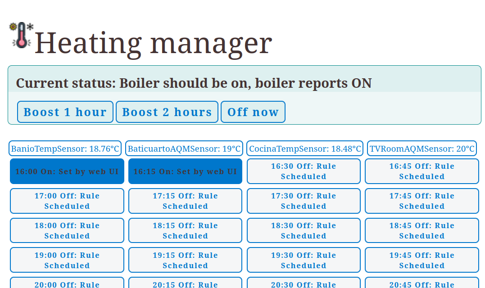
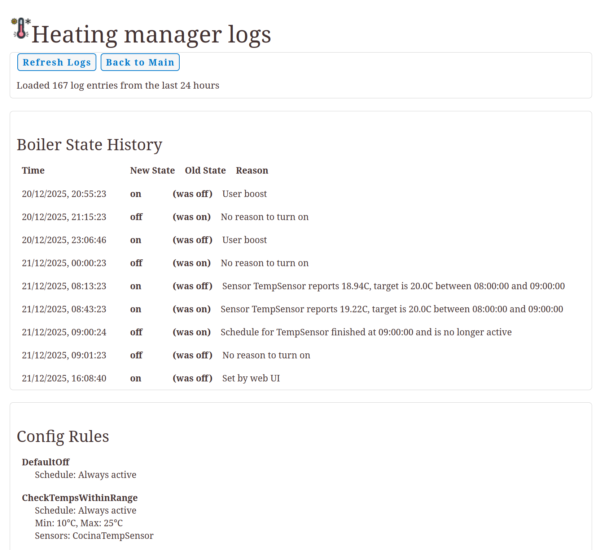

# ZmwHeating

Heating system manager controlling a boiler via Zigbee relay.

This service controls an on/off relay powering a boiler, based on a configurable schedule. It doesn't support any kind of OpenTherm or other advanced boilers, just on/off. This service

* Allows to set a schedule by 15-minute increments: the schedule can be always-on, always-off or rule based. Always on/off will always turn the boiler on/off at the specified time. Rule-based means the service decides the state of the system based on a set of rules.
* Enables quick user overrides: the UI has a "boost" button that will turn on the heating for an hour or two, overriding current rules.
* Quick off override: when the boiler is on but is not needed, override-off will turn the boiler off until the next time a new rule would apply (either a new schedule, a new user override, or a change in rule type).
* Telegram overrides: the service integrates with the ZmwTelegram service, if the service is running. You can send `/tengofrio` via Telegram to have a warm toasty home when you arrive home.
* Telegram notifications: no need to wait 10 minutes to know if the radiators will get warm, ZmwHeating will send you a Telegram message when the boiler turns on (or off). No need to guess on what the boiler state is.
* Rule based heating: this service will read Zigbee2Mqtt sensors. You can build rules based on these:
    * AlwaysOn/AlwaysOff is a rule that will always turn the boiler on/off. This is a fallback default rule.
    * CheckTempsWithinRange will turn a boiler on if a temperature is outside of a target range, with some hysteresis.
    * ScheduledMinTargetTemp works like CheckTempsWithinRange but during a specified time window.
* Schedule saving: the service will remember today's schedule, and a template configuration. Boiler state will survive any service crash.

## Explainability First

The service is built with explainability-first goals: it should always be clear why the system is in the state it is. The service will "explain" which rules apply to turn the boiler on or off, via Telegram and via its web UI. Over Telegram, for example, it will deliver a message such as `Heating is now on (was off). Reason: Sensor TempSensor reports 18.94C, target is 20.0C between 08:00:00 and 09:00:00`.

## WWW Endpoints

- `/svc_state` - Current schedule, boiler state, sensor readings
- `/get_cfg_rules` - Configured heating rules
- `/active_schedule` - Current day's schedule
- `/boost=<hours>` - Activate heating boost
- `/off_now` - Turn heating off immediately
- `/slot_toggle=<name>` - Toggle a schedule slot
- `/template_slot_set=<vals>` - Set template slot
- `/template_apply` - Apply template to today
- `/template_reset=<state>` - Reset template schedule
- `/template_schedule` - Get template schedule
